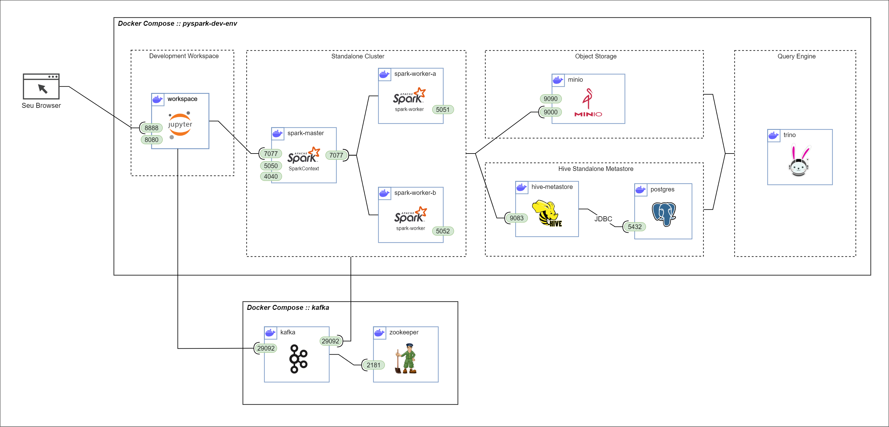

Ou pastabricks, se preferir, é um ambiente de desenvolvimento interativo que criei para praticar PySpark

Montado utilizando Docker Compose ele estrutura um Jupyter Lab, Cluster Spark, MinIO object storage, Hive Metastore, Trino e de quebra vem um Kafka pra simular eventos/streaming.

Requisitos:
- Docker Desktop
- Docker Compose

Para utilizá-lo basta clonar o repositório e executar no diretório principal o comando:

> docker compose up -d

o docker vai buildar as imagens sozinho, recomendo uma conexão de internet boa e estável

Acesse os logs do workspace para obter o link do Jupyter Lab.

> docker logs pyspark-dev-env-workspace-1

(se preferir pode ver nos logs do Docker Desktop também)

Clique no link _http://127.0.0.1:8888/lab?token=<token_gigante_super_seguro>_

Para iniciar o broker kafka você deve ir até o diretório kafka desse repositório e executar:

> docker compose up -d

### O que é criado?

Os templates docker-compose.yml criam uma série de containers, entre eles:

#### Workspace
Um cliente Jupyter Lab para sessões de desenvolvimento interativo com:
+ Diretório _work_ para persistir scripts e notebooks criados;
(e ainda tem uns scripts que usei pra testar as funcionalidades incluindo um producer kafka para gerar eventos aleatórios!)
+ spark-defaults.conf para facilitar configuração das SparkSessions no cluster;
(criar a spark session nunca foi tão fácil!)
+ Extensão jupyter_sql_editor instalada para utilização dos comandos magic %sparksql e %trino 
(ainda meio instável e sem auto-completion mas funciona, juro!)

#### MinIO
Uma instância do MinIO, serviço de object storage que emula o funcionamento de um S3 com:
+ Interface web acessivel em localhost:9090
+ API para protocolo s3a na porta 9000
+ Diretório _mount/minio_ e _mount/minio-config_ para persistir dados entre sessões

#### Standalone Spark Cluster
Um cluster Spark para processamento dos workloads contendo:
+ 1 Master node (master na porta 7077, web-ui em localhost:5050)
+ 2 Worker node (web-ui em localhost:5051 e localhost:5052)
+ Dependências necessárias para conexão com o MinIO já instaladas nas imagens
+ Comunicação com MinIO através da porta 9000

#### Hive Standalone Metastore
Uma instância do Hive Standalone Metastore utilizando PostgreSQL no back-end para permitir a persistencia de metadados.
+ Diretório _mount/postgres_ para persistir tabelas entre sessões de desenvolvimento
+ Comunicação com o cluster Spark através do Thrift na porta 9083
+ Comunicação com o PostgresSQL através de JDBC na porta 5432

#### Trino
Uma instancia unica de Trino para servir de motor de query. Já integrado com Hive Metastore e MinIO
+ Catálogo _Hive_ já configurado. Toda tabela criada via PySpark será acessível no Trino
+ Serviço disponível na porta padrão 8080

#### Kafka
Docker compose de uma instancia zookeper + single-node de kafka para criação de um stream de dados fictício com um producer em Python.
+ Utiliza a mesma network criado pelo compose do PySpark.
+ Script de kafka-producer disponível utilizando Faker para gerar eventos aleatórios no kafka
+ Acessivel através do kafka:29092